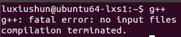
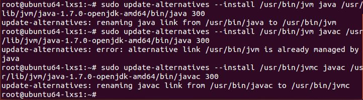
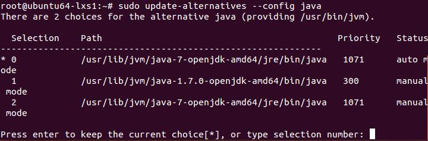
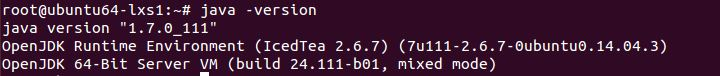
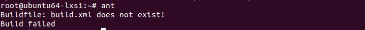
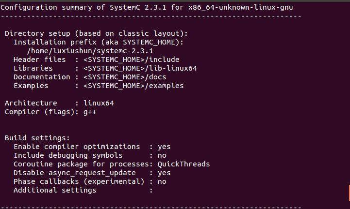
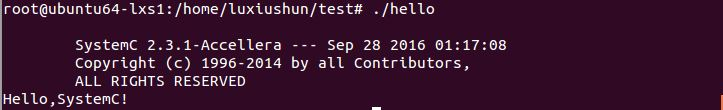
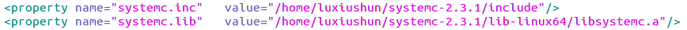
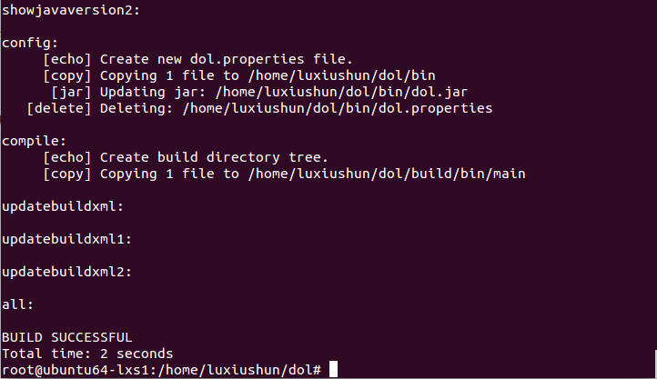
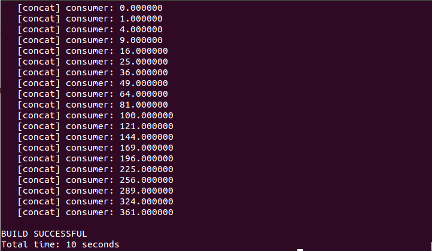

* ###DOL框架描述
  DOL（Distributed Operation Layer）的设计目的是让并行的应用程序在多核处理器上高效的执行。主要结构有三部分：

  * ####DOL API
    支持编写并行化和分布式程序的应用编程接口，便于编程人员编程并且无需对底层的结构有深入的了解。

  * ####DOL功能仿真
    为编程人员提供的一个测试工具，用于在应用层获取程序的性能参数。

  * ####DOL映射优化
    用于计算一个应用程序到处理器的最优映射使得一个应用的各个组件能够在一个分布式的硬件平台上高效地运行。

---

* ###DOL安装笔记

1. ####配置C/C++环境
   sudo apt-get update        	
   sudo apt-get install g++
   g++				（ 通过g++ 命令验证安装是否成功）
   安装成功：

2. ####配置Java环境
   1. #####下载[jdk-8u40-linux-x64](http://www.oracle.com/technetwork/java/javase/downloads/index.html)

   2. #####将安装包解压到 /usr/lib/jvm
      cd /usr/lib
      sudo mkdir jvm
      sudo tar zxvf ./jdk-8u40-linux-x64.gz -C /usr/lib/jvm
      cd /usr/lib/jvm

   3. #####配置环境变量
      sudo gedit ~/.bashrc (在打开的文件的末尾添加JDK所在路径)
      	# enable jdk environment
      	export JAVA_HOME=/usr/lib/jvm/java-1.7.0-openjdk-amd64
      	export JRE_HOME=${JAVA_HOME}/jre
      	export CLASSPATH=.:${JAVA_HOME}/lib:${JRE_HOME}/lib
      	export PATH=${JAVA_HOME}/bin:$PATH
      保存退出，然后输入下面的命令来使之生效
      source ~/.bashrc

   4. #####配置默认JDK
      sudo update-alternatives --install /usr/bin/java java  /usr/lib/jvm/java-1.7.0-openjdk-amd64/bin/java 300
      sudo update-alternatives --install /usr/bin/javac javac /usr/lib/jvm/java-1.7.0-openjdk-amd64/bin/javac 300
      (/usr/lib/jvm/java-1.7.0-openjdk-amd64为JDK所在路径)

      
      sudo update-alternatives --config java	查看当前各种JDK版本和配置
      

   5. #####通过以下命令验证配置是否成功
      java -version	  # 查看JDK版本
      java
      javac
      

3. ####安装 Ant (version 1.6.5 or greater) 
   (参考教程：<http://www.cnblogs.com/shitouer/archive/2011/08/31/2160467.html>)
   sudo apt-get install ant
   使用 ant命令验证安装成功
   


4. ####安装SystemC
   1. #####安装与配置
      sudo tar -zxvf systemc-2.3.1.tgz -C /home
      cd /home/systemc-2.3.1
      sudo mkdir objdir
      cd objdir
      ../configure --disable-async-updates	 # 进行环境验证
      

      sudo make			
      sudo make check
      sudo make install

   2. #####测试 
      ###### a. 编写hello.h文件
      ```c++
      #ifndef _HELLO_H
      #define _HELLO_H
      #include "systemc.h"
      #include <iostream>
      using namespace std;

      SC_MODULE(hello){
      	SC_CTOR(hello){
      		cout<<"Hello,SystemC!"<<endl;
      	}
      };
      #endif
      ```

      ###### b.编写hello.cpp文件
      ```c++
      #if 1
      #include "hello.h"
      #else
      #include "systemc.h"

      class hello : public sc_module{
      public:
          hello(sc_module_name name) : sc_module(name){
                  cout<<"Hello,SystemC!"<<endl;
          }
      };
      #endif

      int sc_main(int argc,char** argv){
          hello h("hello");
          return 0;
      }
      ```

      ###### c.编写Makefile
      ```Makefile
      LIB_DIR=-L /home/tarantula-7/Softwares/DOL-env/systemc-2.3.1/lib-linux64
      INC_DIR=-I /home/tarantula-7/Softwares/DOL-env/systemc-2.3.1/include

      LIB=-l systemc

      APP=hello

      all:
      	g++ -o $(APP) $(APP).cpp $(LIB_DIR) $(INC_DIR) $(LIB) 

      clean:
      	rm -rf $(APP)
      ```

      ###### d.将上述文件放在同一个目录下,cd进入该目录 make之后即可通过 ./hello运行成功信息如下：
      


5. ####配置DOL
   1. #####下载[DOL压缩包](http://www.tik.ee.ethz.ch/~shapes/downloads/dol_ethz.zip)并解压
      unzip dol_ethz.zip

   2. #####修改build_zip.xml文件
      <property name="systemc.inc" value="YYY/include"/>
      <property name="systemc.lib" value="YYY/lib-linux/libsystemc.a"/>
      （YYY为systemc的安装路径）
      

   3. #####编译DOL
      ant -f build_zip.xml all
      

   4. #####运行示例
      cd build/bin/main
      ant -f runexample.xml -Dnumber=1
      

      ##### 至此，DOL安装完成。

---- ----

* ###感想

  1. 对DOL的框架有了大体的认识。
  2. 对分布式版本控制系统git有了初步认识。
  3. 掌握了一门新的轻量级的文本标记语言markdown。


